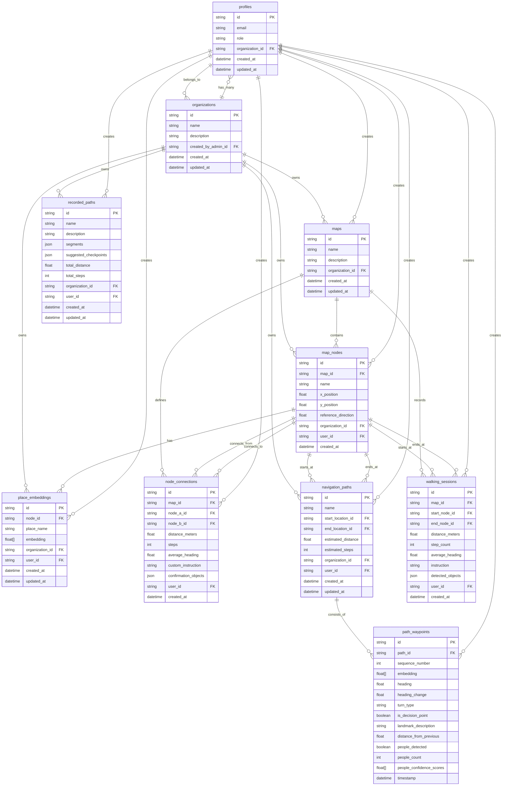

# 4.6 Database Design

## Database Schema Overview

The indoor navigation system utilizes a PostgreSQL database hosted on Supabase with a multi-tenant architecture. The database consists of 11 main entities designed to support AI-powered navigation for visually impaired users.

## Entity-Relationship Diagram

## Key Entities Description

### Core Entities
- **profiles**: User accounts with organization membership
- **organizations**: Multi-tenant data isolation containers
- **maps**: Indoor environment representations
- **map_nodes**: Physical locations (rooms, corridors, landmarks)

### AI Integration
- **place_embeddings**: DINOv2/CLIP visual signatures (768-dim vectors)
- **path_waypoints**: Sequential embeddings for navigation guidance

### Navigation Data
- **node_connections**: Pathways between locations with distance and instructions
- **navigation_paths**: Pre-recorded routes between destinations
- **walking_sessions**: User movement data for path optimization
- **recorded_paths**: User-created navigation routes

## Database Architecture Features

### Multi-Tenant Design
- Organization-based data isolation using Row-Level Security (RLS)
- Users can only access data within their organization
- Admins manage users and data within their organizations

### AI-Powered Navigation
- 768-dimensional embeddings for visual place recognition
- Dynamic similarity thresholds based on scene complexity
- Majority voting system for reliable localization

### Performance Optimizations
- Optimized float array storage for embeddings
- Cosine similarity calculations for fast matching
- Sequential waypoint processing for real-time guidance

This database design supports the complete indoor navigation workflow from user management through AI-powered localization to real-time navigation guidance.
