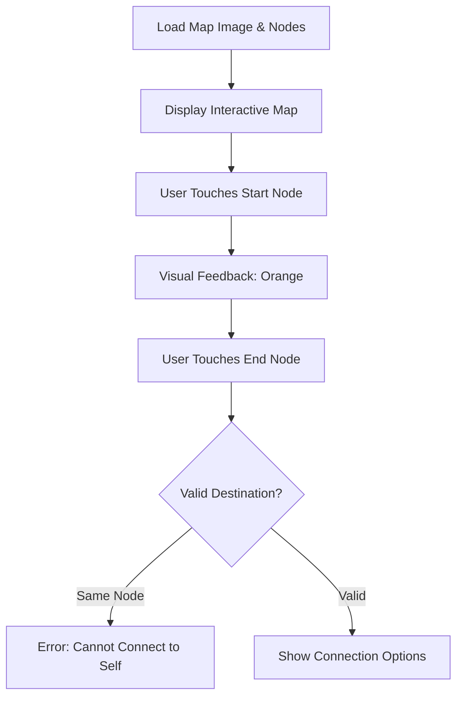
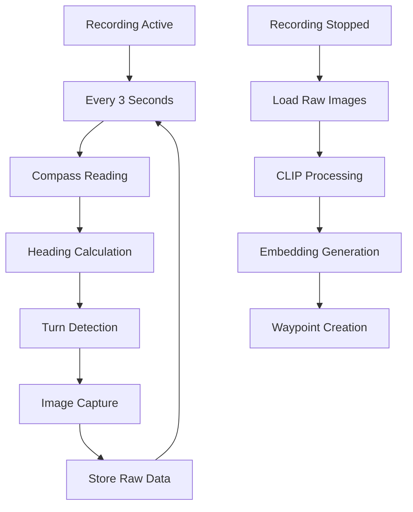
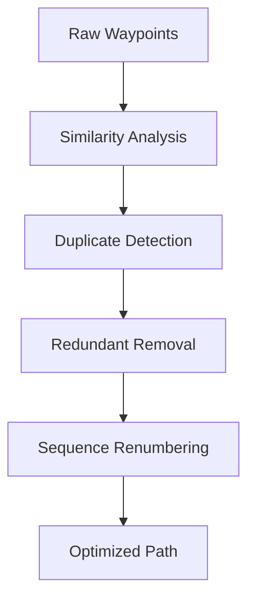
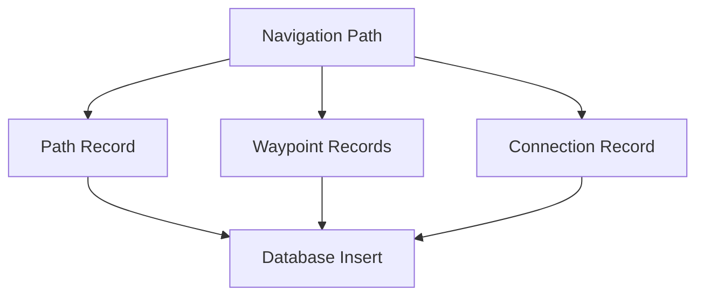
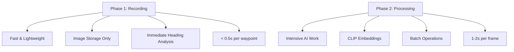
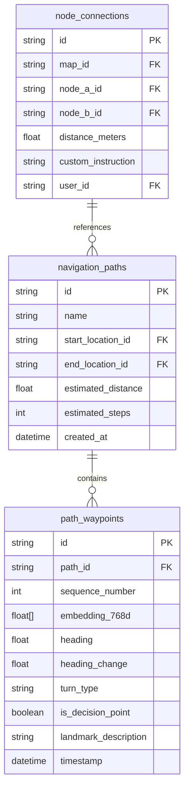
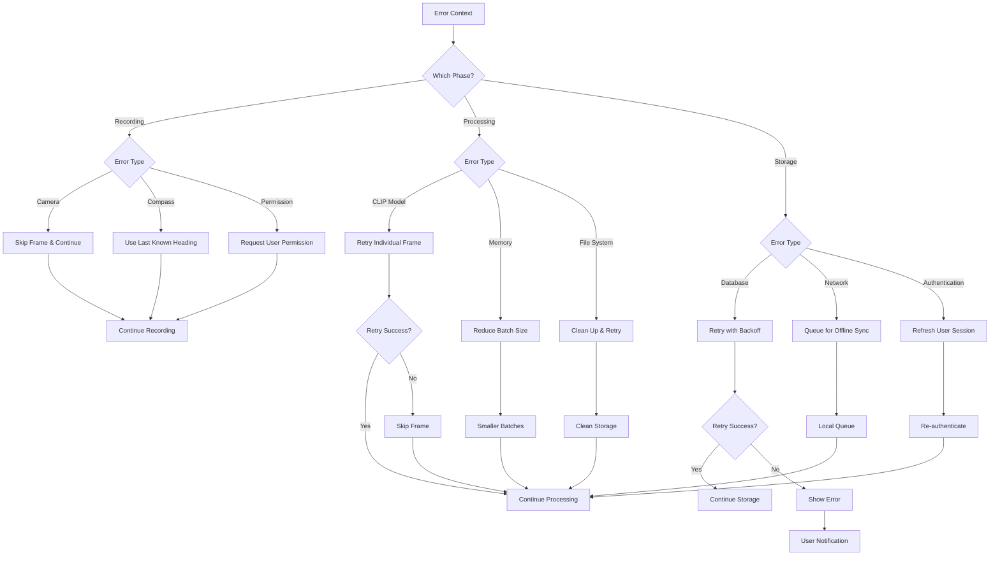

# Node Connection (Edge Creation) Flowchart - Indoor Navigation System

## Complete Unified Edge Creation Process

```mermaid
graph TD
    %% START & NODE SELECTION
    START([User Opens Node Connection Screen]) --> A[Load Map & Node Data]
    A --> B[Display Interactive Map with Nodes]
    B --> C[User Selects Start Node]
    C --> D[Visual Feedback: Orange Highlight]
    D --> E[User Selects End Node]
    E --> F{Valid Connection?}
    F -->|Invalid| G[Show Error & Reset Selection]
    G --> C
    F -->|Valid| H[Show Connection Dialog]

    %% RECORDING DECISION & SETUP
    H --> I{User Choice}
    I -->|Cancel| J[Clear Selection & Return]
    I -->|Record Path| K[Launch Path Recording Screen]
    K --> L[Initialize Camera Controller]
    L --> M[Initialize CLIP Service]
    M --> N[Initialize Compass Monitoring]
    N --> O[Configure Recording Parameters]
    O --> P[Set 3s Capture Interval]
    P --> Q[Set 30° Heading Threshold]
    Q --> R[Set 95% Similarity Threshold]
    R --> S[Start Continuous Recording]

    %% ACTIVE RECORDING LOOP - PHASE 1: RAW DATA COLLECTION
    S --> T[Timer Trigger Every 3 Seconds]
    T --> U{Check Recording State}
    U -->|Stopped| V[Exit Recording Loop]
    U -->|Active| W[Read Current Compass Heading]
    W --> X[Normalize Heading 0-360°]
    X --> Y[Calculate Heading Change from Previous]
    Y --> Z[Handle 360° Wraparound Correction]

    Z --> AA[Detect Turn Type]
    AA --> BB{Heading Change > 30°?}
    BB -->|Yes| CC[Mark as Decision Point]
    BB -->|No| DD[Mark as Regular Waypoint]

    CC --> EE[Generate Turn Instruction]
    DD --> EE
    EE --> FF[Take Camera Picture]
    FF --> GG[Store Image File Path Only]
    GG --> HH[Create RawWaypointData Object]
    HH --> II[Add to Raw Waypoints List]
    II --> JJ[Update Last Heading Reference]
    JJ --> T

    %% POST-RECORDING PROCESSING - PHASE 2: BATCH EMBEDDING GENERATION
    V --> KK[Stop All Timers & Sensors]
    KK --> LL[Begin Batch Processing]
    LL --> MM{Process Each Raw Waypoint}
    MM --> NN[Load Stored Image File]
    NN --> OO[Send to CLIP Service]
    OO --> PP[Generate 768-dim Embedding]
    PP --> QQ[Create PathWaypoint Object]
    QQ --> RR[Delete Image File from Storage]
    RR --> SS[Add to Processed Waypoints List]
    SS --> TT{More Raw Waypoints?}
    TT -->|Yes| MM
    TT -->|No| UU[Apply Similarity Filtering]

    %% SIMILARITY FILTERING - PHASE 3: OPTIMIZATION
    UU --> VV[Compare Adjacent Waypoints]
    VV --> WW[Calculate Cosine Similarity]
    WW --> XX{Similarity > 95% AND Heading Diff < 10°?}
    XX -->|Yes| YY[Remove Duplicate Waypoint]
    YY --> ZZ[Update Sequence Numbers]
    XX -->|No| AAA[Keep Waypoint]
    AAA --> BBB{More Waypoints to Compare?}
    BBB -->|Yes| VV
    BBB -->|No| CCC[Final Filtered Waypoints Ready]

    %% DATABASE STORAGE - PHASE 4: PERSISTENCE
    CCC --> DDD[Create NavigationPath Object]
    DDD --> EEE[Generate Unique Path ID]
    EEE --> FFF[Set Start/End Node References]
    FFF --> GGG[Calculate Path Statistics]
    GGG --> HHH[Insert into navigation_paths Table]

    HHH --> III[Prepare Waypoint Batch Data]
    III --> JJJ[Link Waypoints to Path ID]
    JJJ --> KKK[Format Embedding Vectors]
    KKK --> LLL[Include Heading & Turn Metadata]
    LLL --> MMM[Batch Insert into path_waypoints]

    MMM --> NNN[Create Node Connection Record]
    NNN --> OOO[Generate Connection ID]
    OOO --> PPP[Link Node A & Node B]
    PPP --> QQQ[Reference Navigation Path]
    QQQ --> RRR[Calculate Distance & Metrics]
    RRR --> SSS[Insert into node_connections]

    %% COMPLETION & INTEGRATION
    SSS --> TTT[Show Success Message]
    TTT --> UUU[Return to Connection Screen]
    UUU --> VVV[Refresh Map Display]
    VVV --> WWW[Draw Connection Line with Arrows]
    WWW --> XXX[Update Navigation Graph]
    XXX --> YYY[Enable Pathfinding Integration]

    %% ERROR HANDLING INTEGRATED
    ZZZ[Error Occurs] --> AAAA{Error Phase & Type}

    AAAA -->|Recording: Hardware| BBBB[Camera/Compass Error]
    AAAA -->|Recording: Permission| CCCC[Request Permissions]
    AAAA -->|Processing: AI Model| DDDD[Retry CLIP Processing]
    AAAA -->|Processing: Memory| EEEE[Reduce Batch Size]
    AAAA -->|Storage: Database| FFFF[Retry Database Save]
    AAAA -->|Storage: Network| GGGG[Queue for Offline Sync]

    BBBB --> HHHH[Show Hardware Error]
    CCCC --> IIII{Permissions Granted?}
    DDDD --> JJJJ{Retry Success?}
    EEEE --> KKKK[Process Smaller Batches]
    FFFF --> LLLL{Save Success?}
    GGGG --> MMMM[Store Locally]

    IIII -->|Yes| NNNN[Continue Recording]
    IIII -->|No| OOOO[Show Permission Required]

    JJJJ -->|Yes| PPPP[Continue Processing]
    JJJJ -->|No| QQQQ[Skip Failed Frame]

    LLLL -->|Yes| RRRR[Continue Process]
    LLLL -->|No| SSSS[Show Database Error]

    MMMM --> PPPP
    KKKK --> PPPP
    QQQQ --> PPPP
    RRRR --> PPPP

    HHHH --> TTTT[Guide to Troubleshooting]
    OOOO --> TTTT
    SSSS --> TTTT

    TTTT --> UUUU[End Process or Return to Start]
```

## Process Breakdown

### **Phase 1: Node Selection & Validation**

### **Phase 2: Path Recording - Two-Stage Processing**

### **Phase 3: Optimization & Filtering**

### **Phase 4: Database Persistence**

## Key Technical Specifications

### **Recording Parameters**
- **Capture Interval**: Every 3 seconds
- **Decision Point Threshold**: 30° heading change
- **Similarity Threshold**: 95% cosine similarity
- **Heading Tolerance**: 10° for duplicate filtering

### **Two-Phase Processing Architecture**

### **AI Processing Pipeline**

### **Database Schema**

### **Performance Metrics**
- **Setup Time**: 2-3 seconds
- **Recording Overhead**: ~0.5 seconds per waypoint (no AI)
- **Heading Calculation**: < 0.1 seconds
- **Turn Detection**: < 0.1 seconds
- **Batch AI Processing**: ~1-2 seconds per frame
- **Database Save**: ~0.1-0.5 seconds per waypoint

## Integration Points

### **System Updates After Edge Creation**
1. **Map Visualization**: Connection lines with directional arrows
2. **Navigation Graph**: Updated pathfinding algorithms
3. **Real-time Navigation**: Turn-by-turn instruction integration
4. **Localization System**: New embeddings for position matching
5. **User Interface**: Path selection in navigation menus

### **Cross-System Dependencies**
- **Node Management**: Requires existing map nodes
- **Map System**: Coordinate system for visualization
- **Camera Hardware**: 360° image capture
- **Compass Sensor**: Heading measurements
- **AI Services**: CLIP model for visual processing
- **Database**: Multi-tenant secure storage

## Error Recovery Strategies

### **Phase-Specific Error Handling**

## Conclusion

The unified node connection process combines:
- **Interactive Selection**: Touch-based node selection with validation
- **Responsive Recording**: Real-time heading analysis without AI lag
- **Batch Processing**: Efficient embedding generation after recording
- **Smart Optimization**: Similarity-based duplicate removal
- **Robust Storage**: Multi-tenant database persistence with security
- **Seamless Integration**: Immediate updates to navigation systems

This comprehensive approach ensures optimal performance, user experience, and system reliability while providing AI-powered indoor navigation capabilities.