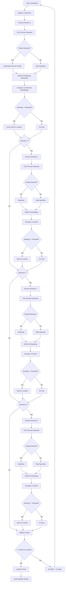

```mermaid
flowchart TD
    A[Start Localization] --> B[Capture 4 Directions]
    B --> C[Process Direction 1]

    C --> D[YOLO Person Detection]
    D --> E{People Detected?}

    E -->|Yes| F[Inpainting: Remove People]
    E -->|No| G[Skip Inpainting]

    F --> H[DINOv2 Embedding Generation]
    G --> H

    H --> I[Compare vs All Stored Embeddings]
    I --> J{Similarity > Threshold?}

    J -->|Yes| K[Count Vote for Location]
    J -->|No| L[No Vote]

    K --> M{Direction 2?}
    L --> M

    M -->|Yes| N[Process Direction 2]
    M -->|No| O{Direction 3?}

    N --> P[YOLO Person Detection]
    P --> Q{People Detected?}
    Q -->|Yes| R[Inpainting]
    Q -->|No| S[Skip Inpainting]
    R --> T[DINOv2 Embedding]
    S --> T
    T --> U[Compare vs Stored]
    U --> V{Similarity > Threshold?}
    V -->|Yes| W[Vote for Location]
    V -->|No| X[No Vote]
    W --> O
    X --> O

    O -->|Yes| Y[Process Direction 3]
    O -->|No| Z{Direction 4?}

    Y --> AA[YOLO Person Detection]
    AA --> BB{People Detected?}
    BB -->|Yes| CC[Inpainting]
    BB -->|No| DD[Skip Inpainting]
    CC --> EE[DINOv2 Embedding]
    DD --> EE
    EE --> FF[Compare vs Stored]
    FF --> GG{Similarity > Threshold?}
    GG -->|Yes| HH[Vote for Location]
    GG -->|No| II[No Vote]
    HH --> Z
    II --> Z

    Z -->|Yes| JJ[Process Direction 4]
    Z -->|No| KK[Majority Voting]

    JJ --> LL[YOLO Person Detection]
    LL --> MM{People Detected?}
    MM -->|Yes| NN[Inpainting]
    MM -->|No| OO[Skip Inpainting]
    NN --> PP[DINOv2 Embedding]
    OO --> PP
    PP --> QQ[Compare vs Stored]
    QQ --> RR{Similarity > Threshold?}
    RR -->|Yes| SS[Vote for Location]
    RR -->|No| TT[No Vote]
    SS --> KK
    TT --> KK

    KK --> UU{2+ Votes for Location?}
    UU -->|Yes| VV[Location Found]
    UU -->|No| WW[No Match - Try Again]

    VV --> XX[Load Available Routes]
    WW --> A
```
