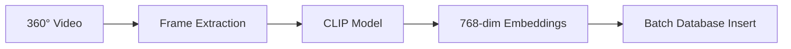
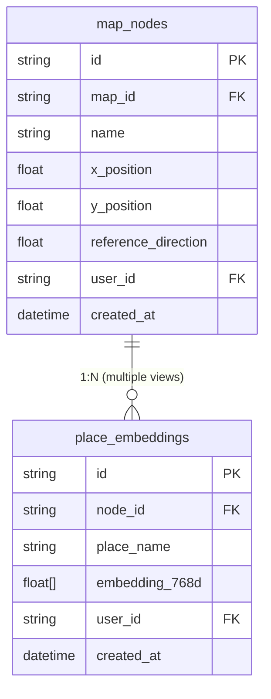
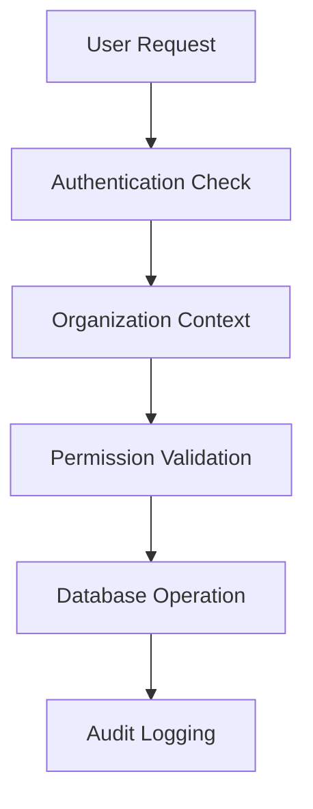

# Node Creation Flowchart - Indoor Navigation System

## Complete Node Creation Process

```mermaid
graph TD
    %% START
    START([User Initiates Node Creation]) --> A{Edit or Create Mode?}

    %% EDIT MODE PATH
    A -->|Edit Mode| B[Load Existing Node Data]
    B --> C[Populate Form Fields]
    C --> D[Display 3-Step Interface]

    %% CREATE MODE PATH
    A -->|Create Mode| E[Initialize Empty Form]
    E --> D

    %% STEP 1: MAP & NAME
    D --> F[Step 1: Map Selection & Naming]
    F --> G[Load Map Image]
    G --> H[Display Interactive Map]
    H --> I[User Selects Position (X,Y)]
    I --> J[User Enters Node Name]
    J --> K{Valid Input?}
    K -->|No| I
    K -->|Yes| L[Store Position & Name]

    %% STEP 2: DIRECTION
    L --> M[Step 2: Direction Capture]
    M --> N[Initialize Compass]
    N --> O[Request Location Permission]
    O --> P{Granted?}
    P -->|No| Q[Show Permission Error]
    P -->|Yes| R[Monitor Compass Heading]
    R --> S[User Captures Reference Direction]
    S --> T[Store Heading Value]

    %% STEP 3: VIDEO
    T --> U[Step 3: Video Recording]
    U --> V[Show Recording Instructions]
    V --> W[Launch Native Camera]
    W --> X[User Records 360° Video]
    X --> Y[Video Saved to Device]
    Y --> Z[Load Video Preview]

    %% VIDEO PROCESSING
    Z --> AA{User Action}
    AA -->|Record Again| W
    AA -->|Process Video| BB[Start Video Processing]

    BB --> CC[Initialize CLIP Model]
    CC --> DD[Extract Frames from Video]
    DD --> EE{Frames Available?}
    EE -->|No| FF[Show Error: No Frames]
    EE -->|Yes| GG[Process Frame Batch]

    GG --> HH[Generate CLIP Embeddings]
    HH --> II[Save to Database]
    II --> JJ{Edit Mode?}
    JJ -->|Yes| KK[Update Existing Node]
    JJ -->|No| LL[Create New Node]
    KK --> MM[Node Updated]
    LL --> NN[Node Created]

    %% DATABASE OPERATIONS
    NN --> OO[Database Operations]
    OO --> PP[Insert map_nodes Record]
    PP --> QQ[Generate Multiple place_embeddings]
    QQ --> RR[Link to Node ID]
    RR --> SS[Apply Organization Security]

    %% COMPLETION
    MM --> TT[Show Success Message]
    SS --> TT
    TT --> UU[Return to Map Screen]
    UU --> VV[Update Navigation Graph]
    VV --> WW[Enable Node Connections]

    %% ERROR HANDLING
    Q --> XX[Error Handling]
    FF --> XX
    XX --> YY{Retry Possible?}
    YY -->|Yes| ZZ[Return to Failed Step]
    YY -->|No| AAA[Show Final Error]
    AAA --> BBB[End Process]

    ZZ --> D
```

## Process Breakdown

### **Phase 1: User Interface (3 Steps)**

#### **Step 1: Map & Name Selection**
- Load interactive map image
- User taps position → Store (X,Y) coordinates
- User enters node name → Validate input
- **Output**: Position coordinates, node name

#### **Step 2: Direction Capture**
- Initialize device compass
- Request location permission
- User captures reference heading
- **Output**: Compass direction (0-360°)

#### **Step 3: Video Recording**
- Display recording instructions
- Launch native camera app
- User records 360° rotation video
- **Output**: Video file for processing

### **Phase 2: Backend Processing**

#### **Video Processing Pipeline**


#### **Database Schema**


### **Phase 3: Security & Access Control**

#### **Multi-Tenant Architecture**
- Organization-based data isolation
- Row-Level Security (RLS) enforcement
- User permission validation
- Admin role management

#### **Data Flow Security**


## Key Technical Details

### **Processing Specifications**
- **Video Format**: 360° rotation recording
- **Frame Rate**: ~30 FPS extraction
- **Embedding Model**: CLIP (Contrastive Language-Image Pretraining)
- **Vector Dimensions**: 768-dimensional embeddings
- **Similarity Metric**: Cosine similarity for matching

### **Performance Metrics**
- **Model Loading**: 2-3 seconds
- **Frame Processing**: 0.5-1 second per frame
- **Database Insert**: 0.1-0.5 seconds per embedding
- **Total Processing**: ~30-60 seconds for 30-second video

### **Error Scenarios & Recovery**
- **Camera Permission Denied** → Guide to settings
- **Video Recording Failed** → Allow retry
- **Model Loading Failed** → Retry with fallback
- **Database Connection Failed** → Offline queue
- **Processing Timeout** → Background continuation

## Integration Points

### **System Updates After Node Creation**
1. **Map Display**: Refresh node markers
2. **Navigation Graph**: Update connectivity
3. **Pathfinding**: Include new waypoints
4. **Localization**: Add new embeddings
5. **Real-time Navigation**: Enable new routes

### **API Endpoints Involved**
- `POST /map_nodes` - Create node
- `POST /place_embeddings` - Save embeddings
- `PUT /map_nodes/{id}` - Update node (edit mode)
- `GET /maps/{id}` - Load map data

## Conclusion

The node creation process is a sophisticated 3-phase workflow that combines:
- **User Experience**: Intuitive 3-step interface
- **AI Processing**: CLIP-based visual recognition
- **Database Architecture**: Multi-tenant secure storage
- **System Integration**: Real-time navigation updates

Each phase is designed to be robust, user-friendly, and scalable for indoor navigation environments.